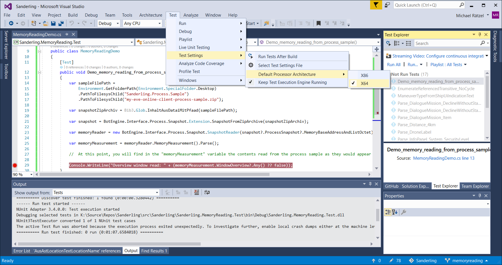

## Adapting the memory reading to changes in the eve online client

### Motivation

Some examples of dependencies of the eve online memory reading implementation:
+ Locations / Dimensions of UI elements within their parent elements.
+ Symbols in the memory which originate from implementation details of the eve online client and 

For changes CCP makes to the eve online client, there is a possibility that this breaks the memory reading due to such dependencies.

### Approach

The botengine/sanderling framework brings tools which make it easy to reproduce the memory reading without the need to start up an actual eve online client instance for the development.

To develop new features or fix failing portions of the memory reading, first take a sample of an eve online client process which serves as an example for the deviation to be corrected.
See the guide at [http://forum.botengine.de/t/collecting-samples-for-memory-reading-development/50](http://forum.botengine.de/t/collecting-samples-for-memory-reading-development/50) for how to save such a sample to a file. This sample file contains a screenshot as well as the memory contents of the chosen process. During development, the screenshot can be used as a reference of what the memory reading implementation should find in the memory contained in the same sample.

### Reproduce the memory reading result from a process sample file

The function named "Demo_memory_reading_from_process_sample" in the sanderling source code demonstrates how to apply the memory reading on a process sample file.
Since this method is marked as a test entry point, you can directly invoke it, for example from the visual studio text explorer.
You might need to set "X64" as the "Default Processor Architecture" in visuals studios "Test Settings" and then rebuild, in order to make the this test entry point show up in the test explorer.
The screenshot below shows how to reach this setting in visual studio 2017:

